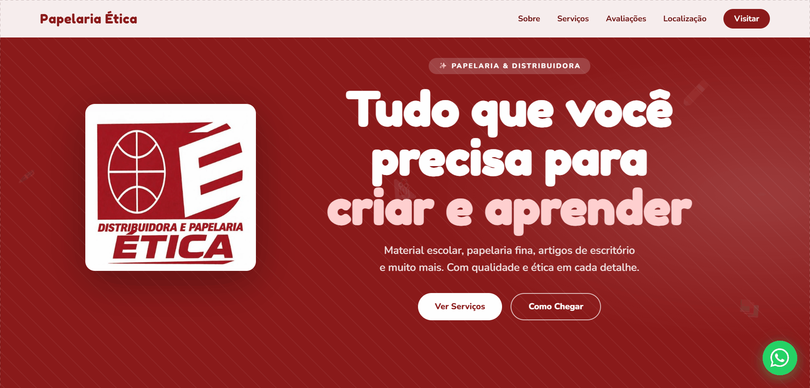
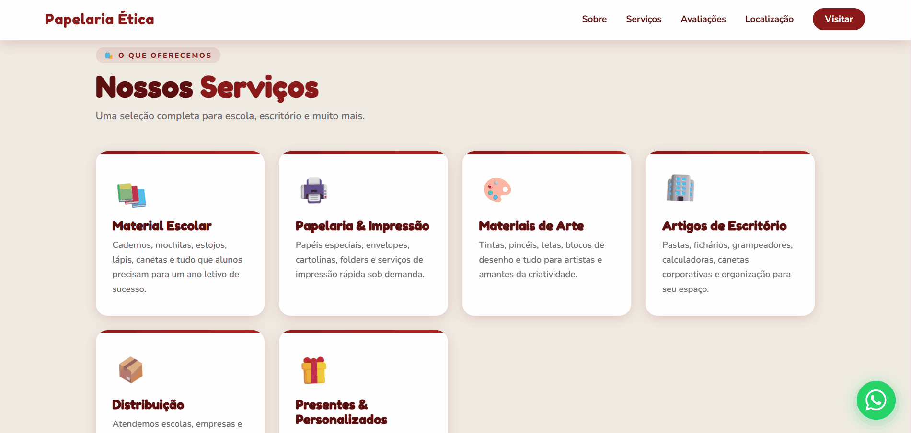
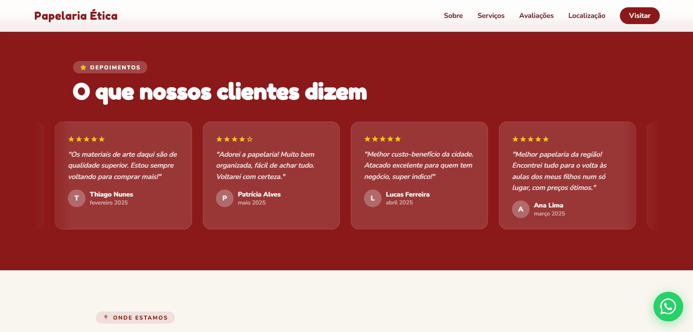
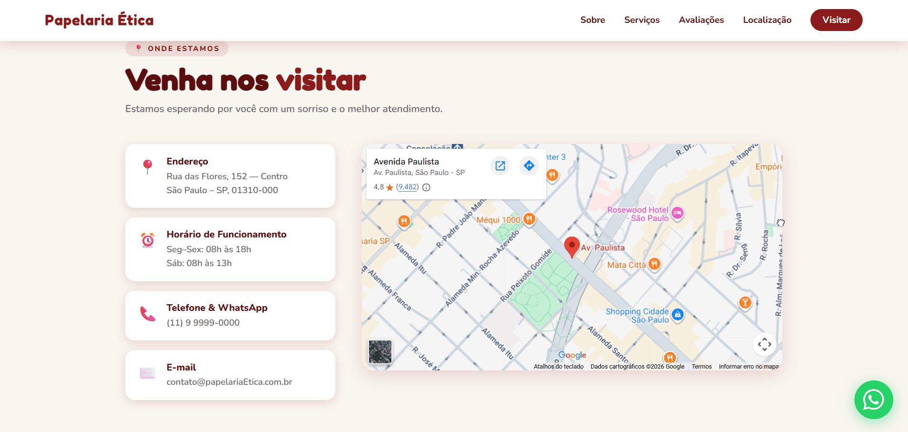

<h1 align="center">🖊️ Papelaria Ética — Landing Page</h1>

<p align="center">
  Landing page responsiva para papelaria e distribuidora, desenvolvida com foco em <strong>UX/UI</strong>, animações CSS e integração com WhatsApp e Google Maps.
</p>

<p align="center">
  <a href="https://noidzika.github.io/Modelo_Site_Papelaria_Etica/" target="_blank">
    
  </a>
</p>
<p align="center">
  
</p>

---

## 🎬 Animações & Experiência Visual

### 🏠 Primeira impressão — Hero section
<p align="center">
  
</p>

> Animações de entrada encadeadas para guiar o olhar do usuário e reforçar a identidade visual da marca.

---

### 🗂️ Cards de serviços interativos
<p align="center">
  
</p>

> Ícones com animação ao hover para criar uma experiência mais dinâmica e convidativa.

---

### 💬 Depoimentos de clientes
<p align="center">
  
</p>

> Carrossel automático de avaliações, reforçando a prova social e a credibilidade do negócio.

---

### 📍 Integração com Google Maps
<p align="center">
  
</p>

> Mapa interativo incorporado diretamente na página, facilitando como o cliente encontra o estabelecimento.

---

## 🎯 Sobre o projeto

Modelo de **landing page comercial** desenvolvido com o tema de papelaria, criado do zero para demonstrar habilidades em front-end. A estrutura e o design foram pensados para converter visitantes em clientes, com foco em:

- Experiência do usuário fluida e intuitiva **(UX)**
- Interface limpa, moderna e atrativa **(UI)**
- **Responsividade total** — mobile, tablet e desktop
- **Animações CSS** encadeadas para enriquecer a experiência
- **Conversão** — integração com WhatsApp em múltiplos pontos da página

> O projeto pode ser adaptado para qualquer tipo de comércio ou negócio local.

---

## ✨ Funcionalidades

- ✅ Navbar com scroll suave entre seções
- ✅ Hero section com animações de entrada
- ✅ Cards de serviços com animação de ícones no hover
- ✅ Seção "Sobre" com métricas do negócio
- ✅ Carrossel automático de avaliações de clientes
- ✅ Google Maps incorporado
- ✅ Integração com WhatsApp (botão flutuante + CTAs)
- ✅ Layout 100% responsivo

---

## 🛠️ Tecnologias utilizadas

| Tecnologia | Uso |
|---|---|
|  | Estrutura semântica da página |
|  | Estilização, animações e responsividade (Flexbox/Grid) |
|  | Menu mobile, carrossel e interações |

---

## 📂 Estrutura de pastas

```
📦 Modelo_Site_Papelaria_Etica
├── 📁 css/            # Estilos da página
├── 📁 js/             # Scripts de interação
├── 📁 imagens/        # Imagens e ícones do site
├── 📁 docsReadmeMd/   # GIFs para o README
└── index.html         # Arquivo principal
```

---

## 🚀 Como rodar localmente

```bash
# Clone o repositório
git clone https://github.com/noidzika/Modelo_Site_Papelaria_Etica.git

# Entre na pasta
cd Modelo_Site_Papelaria_Etica

# Abra o index.html diretamente no navegador
# Não é necessário nenhum servidor ou instalação
```

---

## 📬 Contato

Desenvolvido por **Ulisses Oliveira**

[](www.linkedin.com/in/ulisses-oliveira-2746a614b)
[](https://github.com/noidzika)
